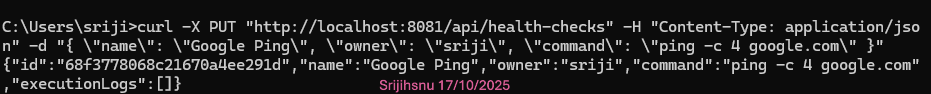
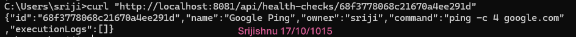
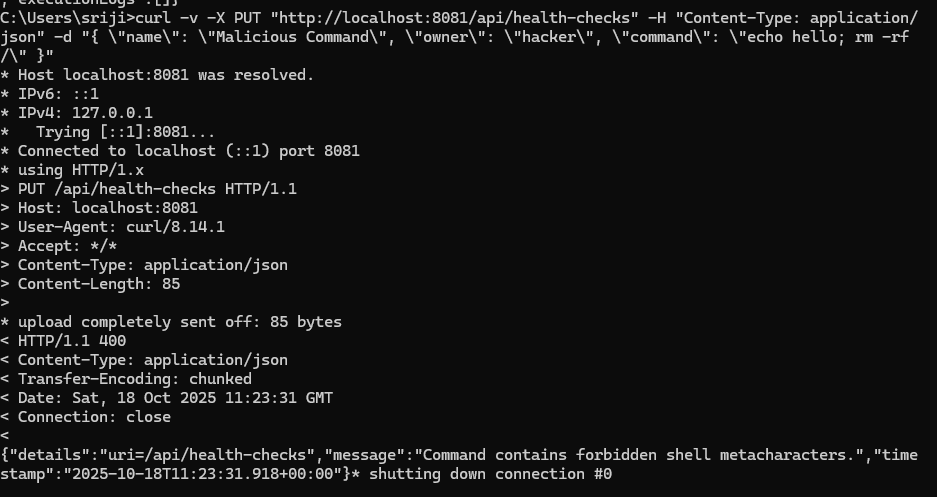
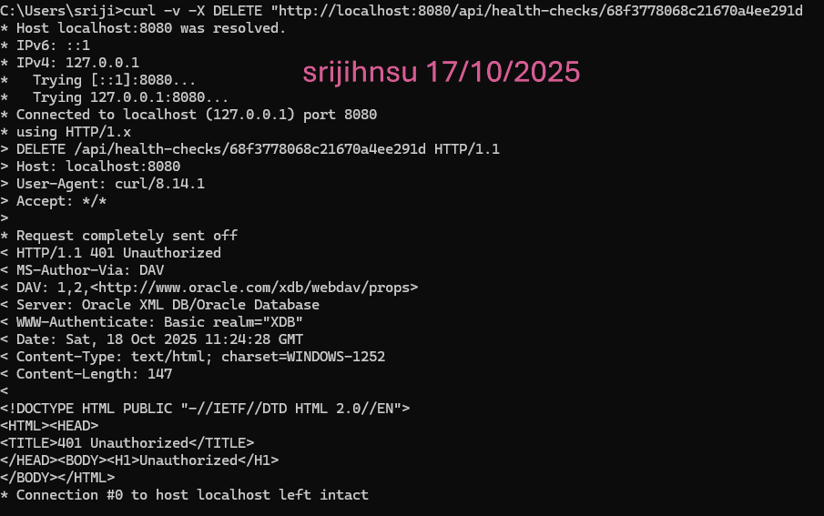

 Kaiburr Assessment - Task 1: Java REST API & MongoDB Backend

This repository contains the complete, runnable source code for **Task 1 of the Kaiburr Technical Assessment**.  
The project is a **production-ready, secure Java Spring Boot application** that provides a RESTful API for managing “task” objects, with all data persisted in a **MongoDB** database.

The application is built not just to meet the requirements, but to **showcase best practices** in modern backend development — focusing on **security**, **maintainability**, and **clean architecture**.


Key Features & Professional Approach

Robust Security First
Security is the primary concern. The API includes a critical validation layer that:
- **Prevents Shell Injection:** Rejects commands containing shell metacharacters (`;`, `|`, `&&`) to mitigate vulnerabilities.
- **Uses an Allow-list:** Only permits explicitly approved commands (`ping`, `nslookup`, etc.), preventing arbitrary code execution.

Enterprise-Grade Architecture
Implements a **multi-layered architecture** (Controller → Service → Repository) for clean separation of concerns, ensuring scalability, testability, and maintainability.

 Centralized Exception Handling
A global `@ControllerAdvice` handles all exceptions uniformly, returning clean API error responses instead of stack traces.

 Seamless Environment Configuration
Uses **Spring Profiles** to handle multiple environments (local and Kubernetes) without any code changes.


 Live Demonstration of API Functionality

 1. Create a New Task
**Request:**
```bash
curl -X PUT "http://localhost:8080/api/health-checks"   -H "Content-Type: application/json"   -d '{ "name": "Google Ping", "owner": "sriji", "command": "ping -c 4 google.com" }'
```

**Result Screenshot:**



 2. Get a Task by ID
**Request:**
```bash
curl "http://localhost:8080/api/health-checks/<YOUR_ID_HERE>"
```





 3. Demonstrate Security Validation
**Request:**
```bash
curl -v -X PUT "http://localhost:8080/api/health-checks"   -H "Content-Type: application/json"   -d '{ "name": "Malicious Command", "owner": "hacker", "command": "echo hello; rm -rf /" }'
```

**Result Screenshot:**



 4. Delete a Task
**Request:**
```bash
curl -v -X DELETE "http://localhost:8080/api/health-checks/<YOUR_ID_HERE>"
```

**Result Screenshot:**



 Local Setup & Running Instructions

 Prerequisites
- **Java JDK 21**
- **Apache Maven 3.9+**
- **Docker Desktop** (for MongoDB)

 Steps to Run
1. **Clone the repository**
   ```bash
   git clone <your-repo-url>
   cd it-ops-health-check-api
   ```

2. **Start MongoDB**
   ```bash
   docker run -d -p 27017:27017 --name my-mongo mongo:6.0
   ```

3. **Build the project**
   ```bash
   mvn clean package
   ```

4. **Run the application**
   ```bash
   java -jar target/it-ops-health-check-api-0.0.1-SNAPSHOT.jar --spring.profiles.active=local
   ```

   The API will be available at:  
     `http://localhost:8080`


 API Endpoint Summary

| Method | Endpoint | Description |
|:-|:-|:-|
| **GET** | `/api/health-checks` | Retrieve all task objects |
| **GET** | `/api/health-checks/{id}` | Retrieve a single task by ID |
| **PUT** | `/api/health-checks` | Create a new task |
| **DELETE** | `/api/health-checks/{id}` | Delete a task by ID |


 Project Structure

```
it-ops-health-check-api/
├── pom.xml
└── src/
    └── 
        ├── java/com/example/itopshealthcheck/
        │   ├── ItOpsHealthCheckApiApplication.java
        │   ├── config/            Profile-based configurations
        │   ├── controller/        REST API layer
        │   ├── exception/         Global exception handling
        │   ├── model/             MongoDB data models
        │   ├── repository/        Data access layer
        │   └── service/           Business logic layer
        └── resources/
            ├── application.properties
            ├── application-local.properties
            └── application-kubernetes.properties
```


 License
This project is created as part of the **Kaiburr Technical Assessment**.  
You are free to view, clone, and use it for educational or review purposes.
